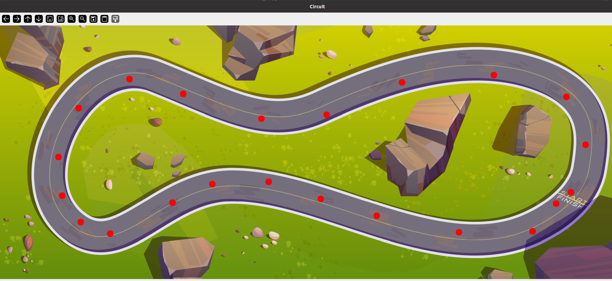
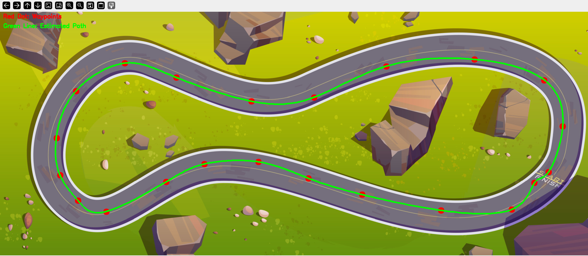

# Path Estimation with Kalman Filter

This project is designed to help understand how the Kalman filter works in a simple scenario. It demonstrates how to estimate and smooth the path of a moving object based on noisy tracking points (dots). The input consists of a series of dots representing the object's position at different times. By applying the Kalman filter, we predict the object's next position based on previous data, then correct it with new measurements as they arrive. The result is a smoothed, continuous path that accurately reflects the object's trajectory, even when the input data is noisy or imprecise.

## Circuit Diagram

Here is the circuit diagram used in the project:

## Input Data: Noisy Tracking Points

The input consists of noisy tracking points (dots) representing the object's position over time. These points may appear imprecise or erratic:

## Path Estimation Result

After applying the Kalman filter to the noisy tracking points, the result is a smooth and accurate estimated path:

## Features:

- **Input**: A series of noisy tracking points (dots).
- **Kalman Filter**: Used to smooth the data and estimate the true path.
- **Output**: A continuous and accurate trajectory.

## Applications

This project can be applied in several fields to help with navigation and position tracking, including:

- **Robotics**: Enabling robots to track their movements and navigate accurately.
- **Computer Vision**: Assisting in object detection and tracking within images or video streams.
- **Autonomous Vehicles**: Helping self-driving cars estimate their position and navigate their environment.

At an advanced level, autonomous vehicles use **SLAM (Simultaneous Localization and Mapping)** combined with real-time camera systems (e.g., Intel RealSense) to map their surroundings while simultaneously determining their position. This approach allows for more accurate navigation in dynamic environments. Our project for autonomous vehicles uses a similar method but leverages the RealSense camera, making it much easier to implement. 

Check out this video for an example of how SLAM is utilized with real-time camera systems in our autonomous vehicle project: [SLAM with RealSense](https://www.youtube.com/watch?v=a1Efa5Dty1Y).
